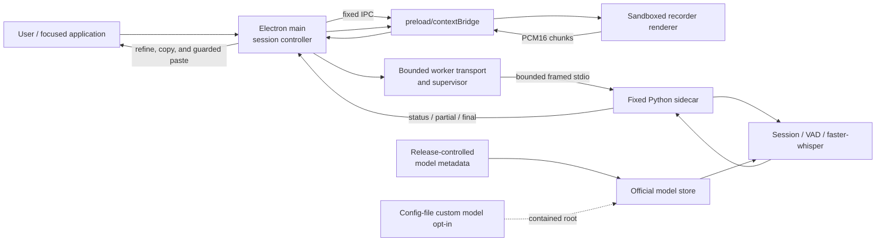

# Architecture

Durianflow is a Windows push-to-talk dictation application. Its local path is main-brokered: the sandboxed Electron recorder captures microphone audio, Electron main validates and routes it, and a supervised Python worker performs VAD and faster-whisper inference over stdio.

## Default local dictation path



The recorder has no backend URL, API token, raw IPC primitive, or network connection. It captures and downsamples audio to mono PCM16 at 16 kHz, then uses the narrow `window.durianflow.dictation` bridge.

## Components

| Component | Responsibility |
| --- | --- |
| `desktop/src/main.js` | Hotkey, tray, main-owned dictation lifecycle, IPC validation, worker launch, transcript routing, LLM refinement, and guarded clipboard completion. |
| `desktop/src/preload.js` | Fixed contextBridge APIs and event subscriptions; no generic IPC access. |
| `desktop/src/recorder.js` | Microphone capture, PCM conversion, bounded pending sends, and local transcript UX. |
| `desktop/src/worker_supervisor.js` | Fixed-sidecar child-process lifecycle, bounded framed I/O, stderr ring buffer, response deadlines, process-tree termination, and shutdown. |
| `desktop/src/local_worker_transport.js` | Session/generation tracking, worker credits, and `start`/`audio`/`stop`/`cancel` commands. |
| `backend/app/worker.py` | Async model load, command intake, session orchestration, stale-result suppression, and protocol events. |
| `backend/app/worker_protocol.py` | Versioned, bounded four-byte length-prefixed JSON framing, strict known-field validation, and safe protocol errors. |
| `backend/app/session.py` | VAD, rolling buffers, partial/final inference triggers, and overlap cleanup. |

## Worker protocol and lifecycle

Electron main and the Python worker use protocol version 1. Each stdin/stdout record is a four-byte big-endian length followed by a UTF-8 JSON object. Worker stdout is protocol-only; logs go to stderr.

Audio is base64-encoded PCM16 within a bounded JSON record. This is intentionally conservative for the initial sidecar implementation. The worker validates envelope version, command type, session ID, generation, sequence, audio encoding, size, and format before audio conversion.

```text
worker: stopped -> starting -> ready
model:  loading -> ready | unavailable
session: idle -> recording -> stopping -> idle
                         -> canceling -> idle
```

`stop` drains accepted audio and finalizes the utterance. `cancel` discards the session; Electron main ignores events for canceled or superseded generations. Cancellation cannot interrupt native inference already executing in a worker thread, so stale transcript suppression is authoritative. Electron main accepts a final result only for the active session while it is finalizing; completed, cancelled, and failed states are terminal.

## Limits and trust boundaries

* Worker records and PCM frames are size-bounded before decoding or processing.
* Electron main maintains bounded write queues and honors child-stdin backpressure.
* The renderer limits unresolved audio submissions and drops newest audio under pressure rather than growing memory without bound.
* Each window receives only its role-specific preload API. Electron main validates sender, exact payload shape, size, and lifecycle state before allocation or forwarding.
* The worker is launched with `shell: false`, piped stdio, a fixed packaged-sidecar path, a small environment, and no local listening port.
* Official models are activated only after `backend/app/model_manifest.py` verification. Custom models require a disabled-by-default configuration-file opt-in (`CUSTOM_MODEL_CONFIG_PATH`) and a canonical path beneath `CUSTOM_MODELS_DIR`; they remain user-managed and untrusted relative to official artifacts.
* Clipboard copy is the default. Opt-in paste checks the captured foreground target again immediately before injection and falls back to copy-only behavior when verification is unavailable or changed.
* The Python sidecar is not an OS sandbox. Durianflow does not protect against malware, an administrator, or an unlocked Windows session.

## Durable state

Durianflow does not store transcripts or audio. Active-session audio, VAD state, metrics, and generated events are memory-only. Durable state is limited to the Electron configuration file and model files/cache.
