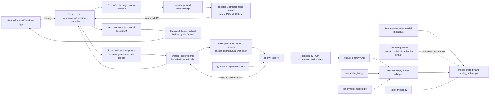

# Repository Flow

Durianflow is a local Electron dictation application. Electron owns user-facing
state and the Python worker owns transcription; the worker exposes no network
listener.

`worker_protocol.py` defines the length-prefixed JSON records, validates
commands, and bounds audio before decode. `protocol.md` documents that local
worker contract. Electron main, rather than any renderer, owns session state,
worker final-result acceptance, and clipboard completion. A session that is
cancelled, failed, or superseded cannot return to an accepting state.

The model boundary separates release-controlled official artifacts from
user-managed custom models. Official metadata must be packaged with the
release and verified before activation. A custom model is accepted only when a
locally configured opt-in root contains it; it is not an official, trusted
artifact merely because it can be loaded.
